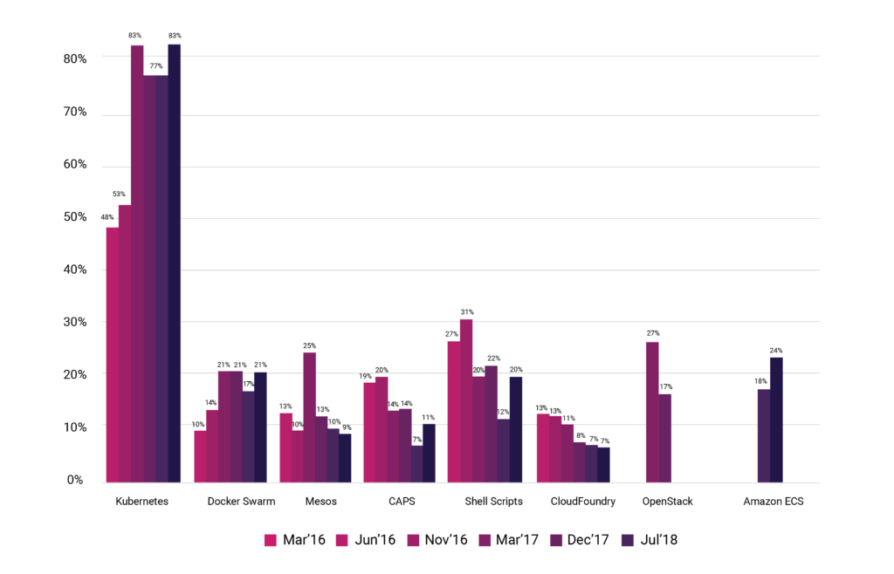
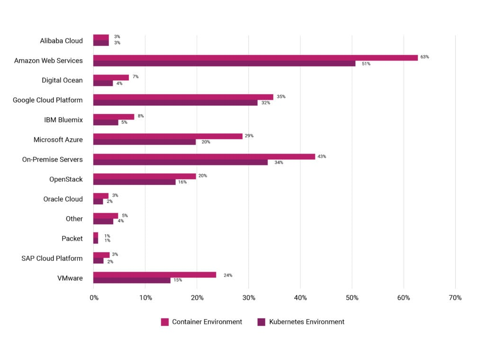

---

What we need:

- repeatability
- consitency
- accuracy
- resource allocation
- scalability
- speedy startup times

Note:
Repeatability is key to troubleshoot underlying issues of a workload
consistency in deployment, container A is identical to container B using the same image
accuracy, the instruciton sets used to declare the system o.s, libraries, resources & executables
resource allocation, a standard set of instructions to define the resource requirements
scalability, easy to spin up more containers & scale horizaontally due to the accuracy & consistency of containers.
An executable run locally, will exhibit the same behaviour in production.

---

**Pivotal Cloud Foundry**

<!-- .element: style="font-size:140%;" -->

<!-- .slide: style="font-size:80%;"> -->

PCF is a **P**latform **a**s **a** **S**ervice offering by Pivotal.
PaaS provides users with a platform & environment for developing, managing & running applications.

Note:
_ (an enterprise offering of the Cloud Foundry Foundation's open source platform, along with IBM, SAP & others )_ \* paas reduces the complexity of building applications
===

<!-- .element: style="font-size:140%;" -->

<!-- .slide: style="font-size:80%;"> -->

- PCF can be hosted on any public cloud/private data centers.
- Handles operational complexity such as O.S patching & updates being by the platform without app down-times.
- Provides scaling, monitoring, self-healing, logging & metrics.
- Uses build-packs to reduce risk, app setup complexity; increase security providing auditing features.
- Manages networking such as app routing, TLS termination
- and so on...

===

<!-- .element: style="font-size:140%;" -->

<!-- .slide: style="font-size:80%;"> -->

- Supports account isolation & control using org, space & roles with RBAC
- Provides build-packs for most languages & deployment types
- Provides easy to use bindable services such as SSO, Databases, Caches, MQs
- Can define custom build packs & services to publish in its marketplace
- Uses container technology (just does not expose it's runtime )
- and so on...

===

**Upsides**

<!-- .element: style="font-size:140%;" -->

<!-- .slide: style="font-size:80%;"> -->

- Simpler platform to support, central operations team manages infra for whole org
- Better security controls as attack surface is reduced
- Easy onboarding, an app just works with build packs!
- Most features required to productionise an app are build into the platform.

===

**Downsides**

<!-- .element: style="font-size:140%;" -->

<!-- .slide: style="font-size:80%;"> -->

- Expensive! Pay for Platform & infrastructure.
- Only portable between Cloud Foundry platforms
- Locked into PCF's definition of apps, services constructs.
- Lesser control of the underlying constructs.
- Lesser flexibility due to BOSH deployment manager complexity & Diego.
- No support for multi-regions, requires customization of the platform.

---

**Kubernetes**
 

<!-- .slide: style="text-align: justified;"> -->

- ~~~~~orchestrates~~~~~ ↝ maintains required compute, storage & networking
- supports containers across multiple hosts
- deploys, maintains & scales applications
- the leading container management platform on public cloud workloads
- open sourced project

Note:
Demonstrates PaaS like features with lifecycle management with IaaS like flexibility.
Kubernetes is portable across multiple infrastructure providers due to its IaaS.
No vendor lock-in to a PaaS or IaaS

No need for orchestration since kubernetes auto targets to maintain a desired state in a deployment

---

2018 CCNF\* Annual Report

_companies/organizations manage containers with:_

<!-- .element: style="font-size:50%;" -->

_\*Cloud Native Computing Foundation_

<!-- .element: style="font-size:20%;" -->

===

_Kubernetes Environment vs. Container Environment_

<!-- .element: style="font-size:50%;" -->

_\*graph above illustrates where respondents are running Kubernetes vs. where they’re deploying containers_

<!-- .element: style="font-size:20%;" -->

Note:

See https://www.cncf.io/blog/2018/08/29/cncf-survey-use-of-cloud-native-technologies-in-production-has-grown-over-200-percent/
for detailed report

---

**Kubernetes Design**

Works with _master_ - _node/worker_ design, with at least one master and multiple compute worker nodes.

The _master_ maintains desired state in the cluster.

The _nodes_ are responsible for providing the Kubernetes runtime.

Note:
The master worker is similar to how Jenkins is structured

The worker nodes is where all the applications would be running.

---

Note:
The API can be accessed via the kubectl CLI or directly via REST API. The API has authentication, authorization and
admission control mechanisms, each of which can have a module implementation, like password, plain tokens, JWT
etc.

Controlling API access: https://kubernetes.io/docs/reference/access-authn-authz/controlling-access/

===

Note:
_kube-apiserver_: is the front end for the Kubernetes control plane.
It can be scaled horizontally when HA is needed, there is usually a load balancer distributing traffic to healthy
kube-apiserver (ex. using HA proxy)

_etcd_: is the consistent key-value store used by Kubernetes's backing store for all cluster data.
This also can be backed up in case of loss of service

_kube-scheduler_: watches for new created pods that are not on a node & assigns a node for them
Factors taken into account for scheduling decisions include individual and collective resource requirements,
hardware/software/policy constraints, affinity and anti-affinity specifications, data locality, inter-workload
interference and deadlines

_kube-controller-manager_: is the component that runs the controllers, they include:

- node controller for watching nodes
- replication controller responsible for maintaining the correct # of pods
- endpoint controller populates the endpoints object i.e joins Services & Pods
- Service Account & Token Controllers: creates default accounts, API access tokens for new namespaces

The control plane is something that is responsible to bring the cluster/app state to how it was described.
The control plane's control loops will respond to changes in cluster by communicating between the master &
kubelet processes to make the state of all objects in the system match desired state.
_More on this later with the Deployment description._

===

Note:
_kubelet_: a daemon agent that runs on each node in the cluster that ensures that containers are running in a pod.
It receives the PodSpecs & ensure that containers described in the spec are running and healthy

_kube-proxy_: network proxy running on each node, maintains rules to allow network communication from inside or outside
of a network to a pod.

_container runtime_: software for running containers: docker, containerd, rktlet/rkt, cri-o (container runtime interface
using open container initiative)

_fluentd_: data stream collector for logging

---

**Kubernetes Objects**

<!-- .element: style="font-size:140%;" -->

<!-- .slide: style="font-size:80%;"> -->

Kubernetes uses Objects to represent the state of a cluster, the objects are persisted & they describe:

- what containers are running
- what resources are available to applications
- policies on the applications, such as restart policies, upgrades and fault-tolerance

Kubernetes API & kubectl are the two ways to create, modify or delete objects.

Note:
The object storage is managed by the etcd

---

**Namespaces**

<!-- .element: style="font-size:140%;" -->

<!-- .slide: style="font-size:80%;"> -->

Namespaces are used to support multiple virtual clusters backed by a single physical cluster.
 

<pre><code lang="shell">
kubectl config set-context --current \
    --namespace={insert-namespace-name-here}
# Validate it
kubectl config view | grep namespace:
</code></pre>

When creating a service with a namespace, it creates a DNS entry in the form:

<pre><code lang="url">
{service-name}.{namespace-name}.svc.cluster.local
</code></pre>

Note:
Names of resources need only be unique in a namespace, but not across namespaces.

---

**Kubernetes Pods**

<!-- .element: style="font-size:140%;" -->

<!-- .slide: style="font-size:80%;"> -->

- Pods are the smallest deployed object in Kubernetes object model which can contain one or more containers.
- Pods are scaled horizontally by spinning up multiple Pods via _replication_. This group abstraction is called a Controller.
- Pods can have **init containers** as well as **app containers**.
- Pods provide two kinds of shared resources in a container: **networking** & **storage**.
- Pods are scheduled by the master's scheduler on run on nodes via the kubelet

Note:
A pod encapsulates an application's container, storage, network IP & other options.
It can encapsulate multiple applications composed of tightly coupled containers which need to share a resource.

Pod networking: each pod has a unique IP address, the constituent containers in a pod share same IP space. Containers can
communicated with each other using localhost. Outbound traffic is via shared network ports.

Pod Storage: all containers share the data in the volume. Volumes allow persistent data in pod to survive in case one
container needs to be restarted.

[The Distributed System Toolkit: Patterns for Composite Containers](https://kubernetes.io/blog/2015/06/the-distributed-system-toolkit-patterns/)

[Container Design Patterns](https://kubernetes.io/blog/2016/06/container-design-patterns)

---

**Pod Lifecycle**

<!-- .element: style="font-size:140%;" -->

<!-- .slide: style="font-size:60%;"> -->

A given pod's status reflects a high-level summary where it is in its lifecycle.
These are the various possibile phases:

- Pending
- Running
- Succeeded
- Failed
- Unknown

The kubelet can probe containers with three types of handlers:

- ExecAction: command inside container, success if exits with status code 0
- TCPSocketAction: TCP check against container's IP address on a port, success if port is open
- HTTPGetAction: HTTP GET on container's IP address on specified port and path, success if HTTP status > 200 & < 400

Note:

DEMO
Get cluster info:

kubectl cluster-info

Get cluster node status:

kubectl describe node <insert-node-name-here>

kubectl get nodes -o yaml

kubectl get pods -o yaml

Best way to learn:

kubectl explain pod,svc etc

kubectl apply -f 1pod.yaml

kubectl get pods

kubectl describe pod node-kube-pod

kubectl exec -it node-kube-pod -- /bin/sh

kubectl get pods -o yaml

kubectl delete pod node-kube-pod

---

<!-- .slide: style="font-size:80%;"> -->

Kubelet can additionally perform two kinds of probes:

- livenessProbe: indicates if the container is running. If not, the container is killed and pushed through restart policy.
- readinessProbe: indicates if container is ready to serve requests, if failed the controller removes Pod's IP Address
  from all services using the Pod.

---

**Labels & Selectors**

<!-- .element: style="font-size:140%;" -->

<!-- .slide: style="font-size:80%;"> -->

Labels are key/value pairs that are attached to objects, 
used to identify objects & organize them

<pre><code lang="json">
"metadata": {
  "labels": {
    "environment" : "dev",
    "tier" : "frontend"
  }
}
</code></pre>

then

<pre><code lang="shell">
kubectl get pods -l environment=dev,tier=frontend
_or_
kubectl get pods -l 'environment in (dev),tier in (frontend)'
</code></pre>

Note:
Annotations unlike labels, cannot be used to identify and select objects.

Additionally Field Selectors allow you to select Kubernetes resources by a resource field value.
Ex:
kubectl get pods --field-selector status.phase=Running

DEMO:

kubectl apply -f 2label.yaml

kubectl get pods --show-labels

kubectl label pods node-lube-pod appid=AP123456

kubectl get pods --selector appid=AP123456

kubectl get pods -l 'env in (dev),appid in(AP123456)'

kubectl delete pod node-kube-pod

---

**Controllers**

<!-- .element: style="font-size:140%;" -->

<!-- .slide: style="font-size:80%;"> -->

Controller can create, manage multiple Pods, handle replication, roll-out, self-healing capabilities at a cluster.

Controllers use a Pod Template that is provided by the user to create the Pods.

 
<pre><code class="yaml">
apiVersion: v1
kind: Pod
metadata:
  name: myapp-pod
  labels:
    app: myapp
spec:
  containers:
  - name: myapp-container
    image: busybox
    command: ['sh', '-c', 'echo Hello Kubernetes! && sleep 3600']
</code></pre>
 
 
 

Note:

I.e Contoller is reponsible of routine tasks to ensure the desired state of cluster matches the observed state.

Ex Replica Sets maintains the correct # of pods running.

Ex: Node Controller checks the state of the server and responds to maser when node goes down.

If a node fails, the Controller might automatically replace the Pod by scheduling an identical replacement on a
different Node.

Pod templates are specifications which are included in other objects such as Replication Controllers, Jobs, DaemonSets etc.

Names for template resources should be unique in a cluster

---

**ReplicaSet**

<!-- .element: style="font-size:140%;" -->

<!-- .slide: style="font-size:60%;"> -->

A ReplicaSet's purpose is to maintain a stable set of Pods running at any given time.
A selector is defined along with the number of replicas to maintain & the corresponding Pod Template.
ReplicaSet then creates & deletes Pods as needed.

<pre><code lang="yaml">
apiVersion: apps/v1
kind: ReplicaSet
metadata:
  name: frontend
  labels:
    app: guestbook
    tier: frontend
spec:
  # modify replicas according to your case
  replicas: 3
  selector:
    matchLabels:
      tier: frontend
  template:
    metadata:
      labels:
        tier: frontend
    spec:
      containers:
      - name: php-redis
        image: gcr.io/google_samples/gb-frontend:v3
</code></pre>

---

**Deployments**

 <!-- .element: style="font-size:140%;" -->

 <!-- .slide: style="font-size:80%;"> -->

Deployment controllers provides declarative updates for Pods & ReplicaSets by describing the desired state.

<pre><code lang="yaml">
apiVersion: apps/v1
kind: Deployment
metadata:
  name: nginx-deployment
  labels:
    app: nginx
spec:
  replicas: 3
  selector:
    matchLabels:
      app: nginx
  template:
    metadata:
      labels:
        app: nginx
    spec:
      containers:
      - name: nginx
        image: nginx:1.7.9
        ports:
        - containerPort: 80

</code></pre>

Note:
the _selector_ field determines how the deployment finds the pods to manage

Use cases:

- Create a Deployment to rollout a ReplicaSet
- Declare the enw state of Pods
- Rollback and earlier Deployment revision
- Scale up the Deployment to facilitate more load
- Pause the Deployment
- Clean up older ReplicaSets

DEMO:

kubectl apply -f 3deployment.yaml

kubectl get deploy

kubectl get rs

kubectl get pods

kubectl exec -it node-kube-deploy-6f6c64b657-f2rt9 -- /bin/sh

curl localhost:4080

kubectl rollout history deployment node-kube-deploy

[update the template container image with new version]

watch -n 0.5 kubectl get pods

kubectl apply -f 3deployment.yaml

kubectl exec -it node-kube-deploy-6f6c64b657-f2rt9 -- /bin/sh

curl localhost:4080

kubectl rollout history deployment node-kube-deploy

kubectl rollout undo deploy/node-kube-deploy --to-revision=1

kubectl rollout history deploy/node-kube-deploy

kubectl get pods

kubectl delete deploy node-kube-deploy

---

**Services**

 <!-- .element: style="font-size:140%;" -->

 <!-- .slide: style="font-size:80%;"> -->

Services is an abstraction that define a logical set of Pods & a policy by which to access them.
Kubernetes assigns a service an IP address which is used by Service proxies (kube-proxy).

<pre><code lang="yaml">
apiVersion: v1
kind: Service
metadata:
  name: my-service
spec:
  selector:
    app: MyApp
  ports:
    - protocol: TCP
      port: 80
      targetPort: 9376
</code></pre>

Note:
In micro services, this is a common pattern where the front ends service does not care which backend they use
or should not have to keep track of it themselves.

Since pods come and go in Kubernetes, service is the way pods can communicate with each other

In the example provided the service binds to the selector. It binds the incoming port, to a target port.

When comparing to DNS A records & using round robin for IP resolution, DNS results are frequently cached which causes issues when the A record's values are
updated frequently.

DEMO:

kubectl apply -f 4services.yaml

kubectl get pods -l app=node-kube

kubectl describe pod node-kube-deploy-6fdddcc8f8-dnfmj

curl 172.17.0.3:4080

kubectl get svc

kubectl describe svc node-kube-service

curl 10.96.180.75:4080

minikube ssh

[cluster]: curl 10.96.180.75:4080

[Uses Virtual IP, in IP tables]

[cluster]: sudo iptables-save | grep node-kube

[Kubernetes DNS]

kubectl get services kube-dns --namespace=kube-system

---

**Volumes**

 <!-- .element: style="font-size:140%;" -->

 <!-- .slide: style="font-size:80%;"> -->

Kubernetes provides a Volume abstration to allow files to be persisted between Pod restarts & sharing files between \
Containers in a Pod.

Some well known types of volumes:

- awsElasticBlockStore
- azureDisk
- configMap
- emptyDir
- hostPath
- local
- nfs
- secret

Note:
kubectl apply -f 5volumes.yaml

kubectl exec -it sharevol -c container1 -- /bin/sh

curl localhost:4080

vi /cache1/data.txt

curl localhost:4080

kubectl exec -it sharevol -c container2 -- /bin/sha

vi /cache2/data.txt

curl localhost:4080

---

**Secrets**

 <!-- .element: style="font-size:140%;" -->

 <!-- .slide: style="font-size:60%;"> -->

Kuberenets lets you store sensitive information like passwords, tls private keys, OAuth tokens etc.

Secret can be used inside Pods from a mounted volume or by kubelet when pulling images to set environment variables.

<pre><code>
>echo -n 'admin' > ./username.txt
>echo -n '1f2d1e2e67df' > ./password.txt
>kubectl create secret generic db-user-pass --from-file=./username.txt --from-file=./password.txt
>kubectl get secrets

NAME                  TYPE                                  DATA      AGE
db-user-pass          Opaque                                2         51s

kubectl describe secrets/db-user-pass

Name:            db-user-pass
Namespace:       default
Labels:          <none>
Annotations:     <none>

Type:            Opaque

Data
-=-=-=
password.txt:    12 bytes
username.txt:    5 bytes
</code></pre>

Note:

echo -n "password" > ./password.txt

kubectl create secret generic mysecret2 --from-file=./password.txt

kubectl describe secrets/mysecret2

kubectl apply -f 6secrets.yaml

kubectl get secrets

kubectl describe secrets mysecret1

kubectl exec -it consumesec -- /bin/sh

---

**Ingress & Service Discovery**

 <!-- .element: style="font-size:140%;" -->

 <!-- .slide: style="font-size:60%;"> -->

An ingress exposes HTTP & HTTPS routes originating from outside the cluster to service within the cluster.

The routing is controlled by _rules_ defined on Ingress.

Ingress can also load balance traffic, terminal SSL/TLS & name based virt. hosting.

Types of Ingress:

- Single service Ingress

<pre><code>
    internet
        |
   [ Ingress ]
   --|-----|--
   [ Services ]
</code></pre>

===

- Simple fanout / path based routing

<pre><code>
foo.bar.com -> 178.91.123.132 -> / foo    service1:4200
                                 / bar    service2:8080
</code></pre>

===

- Name based virtual hosting

<pre><code>
foo.bar.com --|                 |-> foo.bar.com service1:80
              | 178.91.123.132  |
bar.foo.com --|                 |-> bar.foo.com service2:80
</code></pre>

Note:
Single service ingress increase the operational complexity & attack plane

Simple fanout provides a single entry point to services cluster

Name based virtual hosting provides finer grianed control over TLS

---

**Limit Ranges**

 <!-- .element: style="font-size:140%;" -->

 <!-- .slide: style="font-size:60%;"> -->

Containers by default run with unbounded compute resources on a Kubernetes cluser.
Using Resource quotas, the cluster can be configured to limit the resource consumption in a namespace.

Within a namespace as well, individual pods could use all the resources available in a namespace. To limit this, a
Limit Range can be applied in the Pod.

<pre><code lang="yaml">
apiVersion: v1
kind: LimitRange
metadata:
  name: limit-mem-cpu-per-container
spec:
  limits:
  - max:
      cpu: "800m"
      memory: "1Gi"
    min:
      cpu: "100m"
      memory: "99Mi"
    default:
      cpu: "700m"
      memory: "900Mi"
</code></pre>

Limits can also be enforced on Storage & Kubernetes Objects

Note:

The cpu limits are complicated due to calculation of cpu time.
The m in 700m means it needs 700/1000 of a core (70%). The limits are enforced using the cgroup mechamism of the O.S.

---

Note:

kubectl get nodes -o yaml

kubectl get pods -o yaml

**Hands On**
**use https://ngrok.com/ for tests https://www.chenhuijing.com/blog/tunnelling-services-for-exposing-localhost-to-the-web/**
Using the kubectl Command-line
Configuring Pods and Containers
Accessing Applications in a Cluster
Monitoring, Logging, and Debugging
Using TLS

Apply a kube manifest:
kubectl apply -f template.yaml

kubectl diff -f template.yaml

Running a deployment:
kubectl apply -f https://k8s.io/examples/controllers/nginx-deployment.yaml
kubectl rollout status deployment.v1.apps/nginx-deployment
kubectl get deployments
kubectl get rs
kubectl get pods --show-labels
kubectl describe deployments

Updating a deployment:
kubectl --record deployment.apps/nginx-deployment set image deployment.v1.apps/nginx-deployment nginx=nginx:1.9.1

Rollback a deployment:
kubectl rollout history deployment.v1.apps/nginx-deployment
kubectl rollout history deployment.v1.apps/nginx-deployment --revision=2
kubectl rollout undo deployment.v1.apps/nginx-deployment
kubectl rollout undo deployment.v1.apps/nginx-deployment --to-revision=2
kubectl get deployment nginx-deployment
kubectl describe deployment nginx-deployment

Scaling:
kubectl scale deployment.v1.apps/nginx-deployment --replicas=10
kubectl autoscale deployment.v1.apps/nginx-deployment --min=10 --max=15 --cpu-percent=80

Pause & Resume layout:
kubectl rollout pause deployment.v1.apps/nginx-deployment
kubectl rollout resume deployment.v1.apps/nginx-deployment

See this to control deployment strategies https://kubernetes.io/docs/concepts/workloads/controllers/deployment/

Show stateful sets
https://kubernetes.io/docs/tutorials/stateful-application/basic-stateful-set/

**Show securing service & exposing pods to a cluster**

https://kubernetes.io/docs/concepts/services-networking/connect-applications-service/

---
